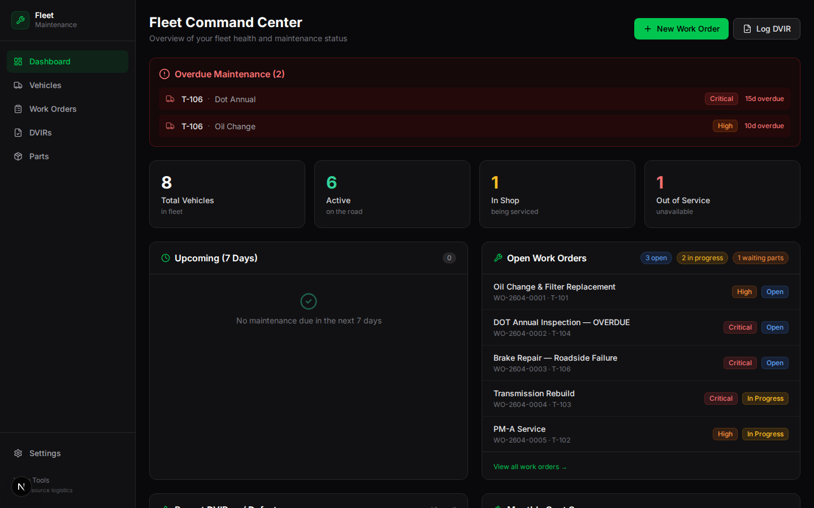
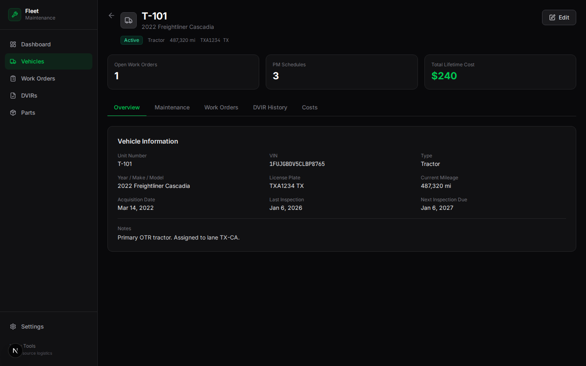

# 🔧 Fleet Maintenance Scheduler

> Free, open-source fleet maintenance management. Track vehicles, schedule PMs, manage work orders, log DVIRs, and monitor parts inventory — no more spreadsheet maintenance schedules.

## Features

### Dashboard
- ✅ Fleet overview stats (active, in shop, out of service)
- ✅ Overdue maintenance alerts with vehicle + service details
- ✅ Upcoming maintenance (next 7 days)
- ✅ Open work orders with priority + status badges
- ✅ Recent DVIRs with defects
- ✅ Monthly cost summary (parts + labor)
- ✅ Quick action buttons (New WO, Log DVIR)

### Vehicle Management
- ✅ Full CRUD with unit number, VIN, make/model, type, mileage
- ✅ Vehicle types: Tractor, Trailer, Straight Truck, Van, Reefer
- ✅ Status tracking: Active, In Shop, Out of Service, Retired
- ✅ Tabbed detail view: Overview, Maintenance, Work Orders, DVIR History, Costs
- ✅ Lifetime cost tracking per vehicle

### Preventive Maintenance Schedules
- ✅ Per-vehicle PM schedules with mile and day intervals
- ✅ Service types: Oil Change, Tire Rotation, Brake Inspection, DOT Annual, and more
- ✅ "Mark Complete" workflow — auto-calculates next due date
- ✅ Priority levels: Low, Medium, High, Critical
- ✅ Overdue detection with dashboard alerts

### Work Orders
- ✅ Full CRUD with WO number, vehicle, type, priority, status
- ✅ Types: Preventive, Repair, Inspection, Emergency, Recall
- ✅ Status workflow: Open → In Progress → Waiting Parts → Completed
- ✅ Parts cost + labor cost tracking with auto-total
- ✅ Assigned technician + vendor tracking
- ✅ Filter by status, priority, type

### DVIR Reports (Driver Vehicle Inspection Reports)
- ✅ Log pre-trip, post-trip, and en-route inspections
- ✅ Dynamic defect logger — add/remove defects per inspection
- ✅ Defect tracking: area, description, severity, corrected status
- ✅ Auto-status: no defects → ✅, defects noted → ⚠️, out of service → 🛑
- ✅ DVIR history per vehicle

### Parts Inventory
- ✅ Track parts: part number, name, category, quantity, min stock, cost
- ✅ Low stock alerts (highlighted when below minimum)
- ✅ Categories: Engine, Brakes, Tires, Electrical, Transmission, Body, HVAC
- ✅ Search + filter by category

### Settings
- ✅ Company info configuration
- ✅ Default PM interval settings

## Quick Start

```bash
cd apps/fleet-maintenance
npm install
npm run db:migrate
npm run db:seed
npm run dev
# → http://localhost:3019
```

## Tech Stack

Next.js 16, Drizzle ORM + SQLite, Tailwind CSS, Lucide Icons, Zod, TypeScript

## Data Model

5 tables: vehicles, maintenance_schedules, work_orders, dvir_reports, parts_inventory

## Screenshots

| Dashboard | Vehicle Detail |
|-----------|---------------|
|  |  |

## Ideas & Next Steps

### 🟢 Easy
- Export work order history to CSV/PDF
- Vehicle photo upload
- Mileage update reminders
- Print-friendly DVIR report

### 🟡 Medium
- Integration with Carrier Management (share vehicle/carrier data)
- Recurring work order templates
- Technician time tracking
- Parts usage history per vehicle
- Email/SMS alerts for overdue maintenance

### 🔴 Hard
- ELD integration for automatic mileage updates
- GPS/telematics integration for real-time vehicle location
- Predictive maintenance based on historical patterns
- FMCSA compliance reporting automation
- Multi-location fleet management with shop assignments

## License

MIT
